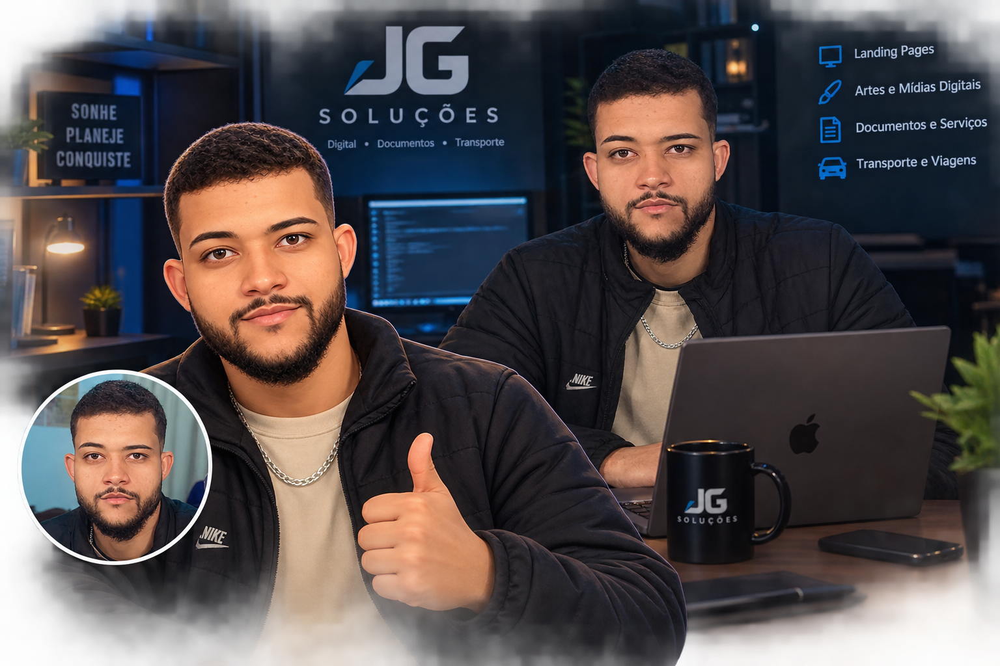

# meusite
Projeto de landing Page JG Soluções

# JG Soluções



## 📌 Sobre o projeto

A **JG Soluções** é uma landing page institucional desenvolvida com o objetivo de apresentar uma empresa fictícia/empreendimento de serviços de forma moderna, profissional e responsiva.

A proposta da página é reunir diferentes áreas de atuação em uma única plataforma, apresentando os serviços de forma clara e facilitando o contato com o cliente.

O projeto foi desenvolvido como parte de um desafio de Front-End, buscando aplicar conceitos de **HTML semântico, CSS moderno, responsividade, organização visual e experiência do usuário (UX)**.

### Áreas de atuação apresentadas

- 🎨 Soluções Digitais
- 📑 Documentos & Serviços
- 🚗 Transporte & Viagens

---

## 🌐 Acesse o projeto

🔗 **Site publicado:**  
[ACESSE A JG SOLUÇÕES](https://junymgomes.github.io/jg-solucoes/)

---

## 🎯 Objetivo

O principal objetivo do projeto foi desenvolver uma landing page que apresentasse a JG Soluções de maneira:

- Profissional;
- Moderna;
- Responsiva;
- Visualmente organizada;
- Fácil de navegar;
- Adaptada para diferentes dispositivos;
- Com chamadas para ação (CTAs);
- Com foco na apresentação dos serviços.

O projeto também teve como objetivo demonstrar conhecimentos fundamentais de desenvolvimento Front-End.

---

## 🛠️ Tecnologias utilizadas

### HTML5

Utilizado para desenvolver a estrutura da página utilizando elementos semânticos, como:

- `<header>`
- `<nav>`
- `<main>`
- `<section>`
- `<article>`
- `<figure>`
- `<footer>`
- `<h1>`, `<h2>`, `<h3>`
- `<p>`
- `<a>`

A utilização de HTML semântico contribui para a organização do código, acessibilidade e melhor interpretação da estrutura da página.

### CSS3

Utilizado para toda a estilização e responsividade do projeto.

Foram utilizados recursos como:

- CSS Grid;
- Flexbox;
- Variáveis CSS (`:root`);
- Media Queries;
- Pseudo-classes;
- Transições;
- Efeitos de hover;
- Gradientes;
- Sombras;
- `clamp()` para tipografia responsiva;
- Layout responsivo;
- `backdrop-filter`;
- Sistema de espaçamento e organização visual.

### Google Fonts

Foi utilizada a fonte **Inter**, buscando uma aparência moderna e profissional para a interface.

---

## 📱 Responsividade

O projeto foi desenvolvido com abordagem responsiva, permitindo sua adaptação para diferentes tamanhos de tela.

Foram considerados principalmente:

- 💻 Desktop;
- 💻 Notebooks;
- 📱 Smartphones;
- 📱 Tablets.

Foram utilizadas **Media Queries em CSS** para reorganizar os elementos conforme a largura disponível.

No desktop, o projeto utiliza layouts em múltiplas colunas.

Em dispositivos menores, os elementos são reorganizados verticalmente para melhorar a leitura e a experiência de navegação.

---

## 🧩 Estrutura do projeto

```text
JG-Solucoes/
│
├── index.html
│
├── css/
│   └── style.css
│
├── img/
│   ├── hero.jpg
│   ├── sobre.jpg
│   ├── digital.jpg
│   ├── documentos.jpg
│   ├── transporte.jpg
│   ├── galeria-01.jpg
│   ├── galeria-02.jpg
│   ├── galeria-03.jpg
│   ├── galeria-04.jpg
│   ├── galeria-05.jpg
│   └── galeria-06.jpg
│
└── README.md